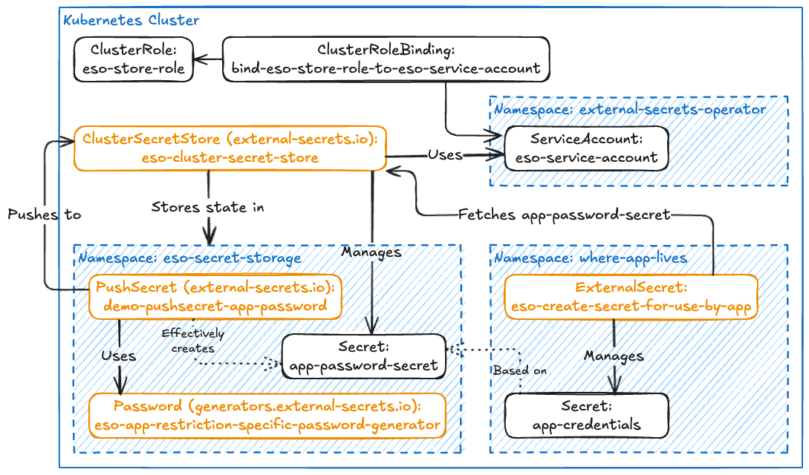

Dynamic secrets locally in Kubernetes
===

This post will explore how to use the [Externla Secrets Operator](https://external-secrets.io/) (ESO) to manage secrets purely internally within a Kubernetes cluster.

This being a use-case that sounds counter intuitive might explain the lack of documentation guiding you through it. Hence this writeup. It also merits a quick look at the background for doing this. A small demo manifest with all the components can be found here: https://github.com/NorskHelsenett/DevBlog/blob/main/BlogPosts/DynamicSecretsUsingExternalSecretsOperator/demo-manifest.yaml

# Background

Our needs originate in running code in Kubernetes, and wanting to limit access to certain parts of it, while also giving other components access to use restricted pieces of other code. Often this manifests as us wanting to use a service outside of our cluster and needing a secret the program we run can use to access the external service. Or conversely we exposing such a service from our cluster, and needing some secret material to verify the inbound traffic. A concrete example would be needing a secret to connect to an externally managed database. Another would be running a component with a webhook relying on a shared secret to authenthorize the inbound request.

In this case, using a secret management solution with an external interface like [OpenBao](https://openbao.org/) would be a good idea, as it makes it easy/hard to mess up stuffing in updated secrets and extracting those you need to share.

However, sometimes the components you want to plug together cohabitate in the same Kubernetes cluster, and have no need of being reachable from the outside, or reaching out themselves. Like for instance a [PostgreSQL](https://cloudnative-pg.io/) database backing a Grafana pod. In this use-case you'd want to have a login for the database to protect it from accidental use from the wrong components in the cluster messing up it's state, and to protect it in the case of a mis-configuration exposing it out of the Kubernetes cluster. However, storing the secret in an external vault would not really make a difference, beyond introducing an additional place it could leak from, and where retrieval could fail.

Then you compound this with our weirdness, where we have separate Kubernetes clusters per product. This is not frightfully expensive because they are on-prem in our own datacenters. And it has the interesting consequences that not only is the amount of damage you can do highly limited to one product at a time, but also that namespacing components becomes more like scoping in code, in that it is used primarily to make it easier to reason about availability/reachability when working with the system, rather than being used as a security boundary.

Finally, ESO is easily available, and already approved of by the organization.

Given this background, let's take a look at the solution.

# Using ESO to manage dynamic secrets locally within our Kubernetes cluster

What we want to do here today is deploy something to Kubernetes, that will generate a password-like mess of bytes, which we can shove into one or more secrets, that our application(s) running in Kubernetes can use internally. Because we have ESO available, we're going to create a setup like illustrated below. An in cluster secret store, a password grenerator used by a push secret to put a new password in the store, and an external secret to extract it and make it available for use in a plain Kubernetes secret.



We're not going to cover how to install/deploy ESO to a Kubernetes cluster, that one-liner is written about enough other places, like for instance [ESO's getting started guide](https://external-secrets.io/main/introduction/getting-started/).

The first thing we need is a good old fashioned Kubernetes [ClusterRole](https://kubernetes.io/docs/reference/access-authn-authz/rbac/#role-and-clusterrole). This is what we'll use to allow the ClusterSecretStore to retrieve the stored secrets once our external secrets ask for them. Because we're setting it up as an in-cluster secret store which we push newly created secrets into for it to manage, the cluster role also needs access to create and later mess with the stored secrets, hence the long list following the `get`, `list`, and `watch` permissions.

```yaml
apiVersion: rbac.authorization.k8s.io/v1
kind: ClusterRole
metadata:
  name: eso-store-role
  namespace: external-secrets-operator
rules:
  - apiGroups: [""]
    resources:
      - secrets
    # "Get", "list", and "watch" are needed for read access
    verbs:
      - get
      - list
      - watch
      - create
      - update
      - patch
      - delete
  # This will allow the role `eso-store-role` to perform **permission reviews** for itself within the defined namespace:
  - apiGroups:
      - authorization.k8s.io
    resources:
      - selfsubjectrulesreviews # used to review or fetch the list of permissions a user or service account currently has.
    verbs:
      - create # `create` allows creating a `selfsubjectrulesreviews` request.
```

For the ESO cluster store to be able to use the role we created above, we need a [ServiceAccount](https://kubernetes.io/docs/reference/access-authn-authz/rbac/#referring-to-subjects) to bind it to:

```yaml
apiVersion: v1
kind: ServiceAccount
metadata:
  name: eso-service-account
  namespace: external-secrets-operator
```

Now that we have the role and account, we glue them together with a [ClusterRoleBinding](https://kubernetes.io/docs/reference/access-authn-authz/rbac/#rolebinding-and-clusterrolebinding) like this:

```yaml
apiVersion: rbac.authorization.k8s.io/v1
kind: ClusterRoleBinding
metadata:
  name: bind-eso-store-role-to-eso-service-account
  # No need to specify namespace, cluster roles are cluster wide
subjects:
  - kind: ServiceAccount
    name: eso-service-account
    namespace: external-secrets-operator
roleRef:
  kind: ClusterRole
  name: eso-store-role
  apiGroup: rbac.authorization.k8s.io
```

After the permissions have been established, we can create the [ClusterSecretStore](https://external-secrets.io/main/api/clustersecretstore/) that we will feed with the created secrets which we can reference from other contexts:

```yaml
# secretstore-cluster-k8s.yaml
apiVersion: external-secrets.io/v1
kind: ClusterSecretStore
metadata:
  name: eso-cluster-secret-store
  # No need to specify namespace, cluster resource is cluster wide
spec:
  provider:
    Kubernetes:
      remoteNamespace: eso-secret-storage
      # Using a serviceAccount that can read the source secret
      auth:
        serviceAccount:
          name: eso-service-account
          namespace: external-secrets-operator
      server:
        url: Kubernetes.default
        caProvider:
          # By magiv exists by default
          type: ConfigMap
          name: kube-root-ca.crt
          namespace: external-secrets-operator
          key: ca.crt
```

Note in this in cluster setup using [ESOs Kubernetes provider](https://external-secrets.io/main/provider/kubernetes/), the ESO store is only a namespace with secrets. There is no actual need to push things at store, every secret in the chosen namespace will be possible to extract by referencing the store. However, should you ever need to support an external store, this approach should give you fewer things you absolutely need to change or set up differently.

At this point we need something to generate our secrets, for which the ESO project kindly supplies a [generator](https://external-secrets.io/main/api/generator/password/) resource:

```yaml
apiVersion: generators.external-secrets.io/v1alpha1
kind: Password
metadata:
  name: eso-app-restriction-specific-password-generator
  namespace: eso-secret-storage
spec:
  length: 42
  digits: 5
  symbols: 5
  symbolCharacters: "-_$@"
  noUpper: false
  allowRepeat: true
```

Note that this generator resource needs to be in the namespace where the [ExternalSecret](https://external-secrets.io/main/api/externalsecret/)/[PushSecret](https://external-secrets.io/main/api/pushsecret/) which does the generation lives in.

When we go on to generate our password, beware the structure of the push secret resource. The `SecertStoreRef: {}` object in our case refers to the ClusterSecretStore, which is the one determining which namespace generated data is stored in. `selector: {}` used to obtain the secret data to stuff in the store. `data: {}` determines where in the secret store the new secret is stored (in our case in a secret specified in `remoteKey: ""`, under key specified in `property`).

```yaml
apiVersion: external-secrets.io/v1alpha1
kind: PushSecret
metadata:
  name: pushsecret-app-password
  namespace: eso-secret-storage # Same NS as generator resource
spec:
  # updatePolicy: IfNotExists # Doesn't work if you want it to not change after creation
  refreshInterval: "0"
  secretStoreRefs:
    - name: eso-cluster-secret-store
      kind: ClusterSecretStore
  selector:
    generatorRef:
      apiVersion: generators.external-secrets.io/v1alpha1
      kind: Password
      name: eso-app-restriction-specific-password-generator # Matches generator name defined above
  data:
    - match:
        secretKey: password # property in the generator output
        remoteRef:
          remoteKey: app-password-secret # Remote reference (where the secret is going to be pushed)
          property: app-password-secret-key # the property to use to push into
```

Take note of the `refreshInterval: "0"` entry. Not all things are happy with changing secrets. Figuring out if using [reloader operator](https://github.com/stakater/Reloader/tree/master) or something similar is viable for your app is out of scope here.

The alternative to using a push secret as illustrated above, is to create the shared password directly in the storage namespace using an ExternalSecret like shown below:

```yaml
apiVersion: external-secrets.io/v1
kind: ExternalSecret
metadata:
  name: eso-app-password
  namespace: eso-secret-storage # where you want the new secret, has to match bot store and generator ns using this apporach
spec:
  # refreshInterval: 1h
  refreshPolicy: CreatedOnce
  target:
    name: app-password-secret
    creationPolicy: Owner
    template:
      data:
        app-password-secret-key: '{{"{{ .password }}"}}' # Note this is helm escaped
  dataFrom:
    - sourceRef:
        generatorRef:
          apiVersion: generators.external-secrets.io/v1alpha1
          kind: Password
          name: eso-app-restriction-specific-password-generator
```

Again note `refreshPolicy` ensuring no autorotation. Also be amazed at the escaping syntax for accessing property named `password` outputted from generator when you need to escape it for helm (you are using helm, right?).

Once the secret is stored, it can be made available for a pod to use from a plain kubernetes secret. Is done like so:

```yaml
apiVersion: external-secrets.io/v1
kind: ExternalSecret
metadata:
  name: eso-create-secret-for-use-by-app
  namespace: where-app-lives # where you want the new secret
spec:
  # refreshInterval: 1h
  refreshPolicy: CreatedOnce
  secretStoreRef:
    name: eso-cluster-secret-store
    kind: ClusterSecretStore
  target:
    name: app-credentials
    creationPolicy: Owner
    template:
      type: Opaque
      # metadata:
      #   labels:
      #     custom: "You can put things here if needed"
      #     optional: "But you don't need to include this section at all if you don't need it"
      data:
        someKey: 'For reasons our app wants a static non-secret thing stored here'
        connectionString: 'you would put our secret {{"{{ .retrievedpassword }}"}} in a thing like this?'
        coolFact: 'Note that you dont need to mess around with base64 encoding!'
  data:
    - secretKey: retrievedpassword # Key used for lookup in templating above in target section
      remoteRef:
        key: app-password-secret
        property: app-password-secret-key # Key used in secret we extract from
```

If you need more secrets using the same password, say for instance you back Grafana with a [CloudNativePG](https://cloudnative-pg.io) database in your cluster, and want both to use the same auto generated password, you can simply deploy several ExternalSecret like the one shown above, all referring to the same generated password stored in the secret store.

Once again, using something like [Reloader](https://github.com/stakater/Reloader/tree/master) to restart Grafana after the secret has been rotated so that we don't need the createdOnce crutches is left for a future text, so that this doesn't become insanely long. (Same goes for stricter namesace permission segregation for those not running in a one-app-per-cluster-with-namespaces-as-convenience setting like us.)

Share and enjoy!
