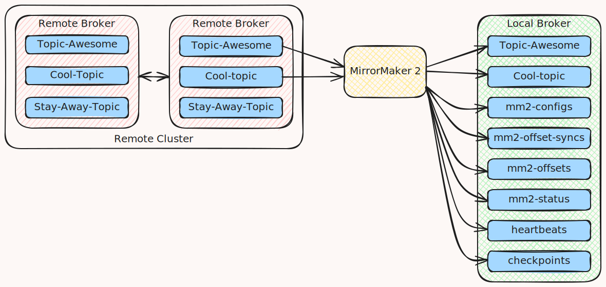

Kafka MirrorMaker 2 mirror from read only cluster
===

Sometimes it's nice to have a dataset locally on your machine when working. This blog post will look into how we can use [Kafkas](https://kafka.apache.org/) MirrorMaker 2 (mm2) to pull down a topic from a remote cluster we don't have write access to, into a local topic. Full example MirrorMaker config for this can be found at bottom of this article.



# Limitations

Beware that there are several limitations and shortcomings of this approach. The config you have to create for mm2 will be non-trivial, because you are starting to veer outside of the intended use-case of creating a mirror of both sides. The operating conditions, where we assume no write access to the remote source cluster, or access to create topics or use the default MirrorMaker 2 state management topics on the remote source cluster side of the mirror, also goes against the grain for MirrorMaker 2. Moreover, because the sync state management is handled in several dedicated topics, you'll get some potentially unwanted noise in the topics overview in the destination cluster. If you enable topic compression in the destination cluster, you can also see worse compression rations than if you write a simple consumer->producer program to do the copying. And you'll likely need some more memory to load the Kafka OCI image compared to what you would spend on a simpler home made consumer/producer program.

# Advantages

With that out of the way; Consider some of the upsides. While the Kafka image where you'll find the MirrorMaker 2 binary has some weight, you'll have to pay that price anyways if you are copying to a Kafka instance you run. Using the Kafka image also means you don't have to maintain additional images and dependencies for your own code as when you would have written a consumer/producer application yourself. And even though the config is non trivial, it's probably still less than the code you'd write and maintain doing it manually. While the extra topics are an ugly complication on the destination cluster, they are often a nice tradeoff, because you don't have to concern yourself with consumer groups on the remote cluster you're syncing data from.

# Practical details

The MirrorMaker 2 binary can be found in the official apache kafka container image `apache/kafka:latest` from https://hub.docker.com/r/apache/kafka , at `/opt/kafka/bin/connect-mirror-maker.sh` in the container. If supplied no arguments it by default it uses the config at `/opt/kafka/config/connect-mirror-maker.properties` if you want to look at the default/an example. To override the default/use your own config you can point `connect-mirror-maker.sh` at a file you've crafted yourself by suppling it as an argument, for instance if you create a custom config at `/mirror-maker-config/mm2.conf`, you can use it like this: `$ /opt/kafka/bin/connect-mirror-maker.sh /mirror-maker-config/mm2.conf`.

The [Kafka documentations section on georeplication](https://kafka.apache.org/documentation/#georeplication) covers many of the ways MirrorMaker can be set up and consideration for the different usage scenarios. At the time of writing (2025-09-15) ideally only one instance/config for mirror maker should be run per destination cluster to prevent conflicts: https://kafka.apache.org/documentation/#georeplication-config-conflicts

A nice overview of many relevant config settings for using MirrorMaker 2 to copy topics from a source to target cluster in the config file here:
https://github.com/flinox/kafka-mirror-maker-2/blob/main/config/mm2-config.properties

## Defining clusters and cluster auth

Because MirrorMaker 2 runs as a [Kafka Connect](https://kafka.apache.org/documentation/#connect) connector, the [MirrorMaker configuration](https://kafka.apache.org/documentation/#mirrormakerconfigs) builds on the [Kafka connect configurations](https://kafka.apache.org/documentation/#connectconfigs). Practically this means that if we in our MirrorMaker config define 2 Kafka clusters `origin` and `destination` like shown below:

```
clusters = origin, destination
```

then we can define auth for the clusters individual in the same way we would when configuring a connector. So for instance to set up SSL auth for the origin cluster we would have a section somewhat like this in the MirrorMaker config

```
origin.security.protocol=SSL
origin.ssl.truststore.type=PEM
origin.ssl.truststore.location=/kafka-secrets/ca.crt
# origin.ssl.truststore.password=my-secret-password
origin.ssl.keystore.location=/kafka-secrets/acl-principal.pfx
origin.ssl.keystore.password=my-secret-password
origin.ssl.key.password=my-secret-password
```

Similarly, if we want to add configurations for the jobs unique to the destination cluster, like for instance only using a replication factor of 1 for certain topics created in the destination cluster because it is a local single node instance, we can do it like this:

```
destination.offset.storage.replication.factor=1
```

## Defining mirroring jobs

Another curiosity arising from MirrorMaker 2 running on Kafka connect is that the mirroring jobs run like separate kafka connect connectors.

So when we begin setting up the Mirroring like this:

```
origin->destination.enabled = true
destination->origin.enabled = false
```

We actually create 2 separately configurable connectors, the `origin->destination` connector and a connector identified as `destination->origin`.

So if we for instance want to configure which topics are mirrored by the `origin->destination` connector, we can do it like so:

```
origin->destination.topics = awesome-topic, topic-cool
```

## ACLs

An interesting property of MirrorMaker is that it can be used to sync not only topics but also ACLs. This is amazing if you use MM2 to set up a set of separate mirrored clusters. In our use-case where we possibly don't even have the rights to list ACLs on the remote cluster never mind write them, or would want the origins ACLs to be applied locally, we want to disable it:

```
sync.topic.acls.enabled = false
```

## Offset sync topics

By default MirrorMaker 2 stores the offsets it has successfully processed in a topic it creates on the cluster where it reads data from. Because we don't have write access to our origin cluster, we need to use the setting to make MirrorMaker 2 use the destination cluster for storing processed offsets:

```
origin->destination.offset-syncs.topic.location = target
```

## Stop attempts at writing to source

Due to the missing write access to the origin cluster, we need to disable all other attempts at creating topics in the remote cluster or using it to store data about the mirroring performed by our MirrorMaker 2 connectors:

```
origin.auto.create.topics.enable=false
origin.topic.creation.enable=false
destination.auto.create.topics.enable=true
destination.topic.creation.enable=true

destination->origin.emit.offset-syncs.enabled = false
destination->origin.emit.checkpoints.enabled = false
destination->origin.sync.group.offsets.enabled = false
destination->origin.emit.heartbeats.enabled = false
```

## Don't sync topic settings

What is appropriate settings for a topic in the remote cluster might not be appropriate for our single node local cluster. To stop MirrorMaker from making a faithful copy of the remote topic with all it's various settings, we can set the `config.properties.exclude` on the `destination->origin` connector to `.*` like this:

```
destination->origin.config.properties.exclude = .*
```

## Don't insert cluster name in mirrored topics

MirrorMaker 2 helpfully inserts the remote cluster name as a prefix in the mirrored topics name. This is nice for working with distributed systems when we have topics mirrored both ways, but for our use-case of faithfully copying from a read only remote cluster it can be nicer to just preserve the topic as it is on the remote cluster. We can do it by setting the `replication.policy.class` config as shown below:

```
replication.policy.class=org.apache.kafka.connect.mirror.IdentityReplicationPolicy
```

# Full working example

This example assumes you have a directory named `ImportCredentials` in the same location as this compose file, and that it contains the following files:

- `ca.crt`: The remote Brokers CA we as a client have to trust
- `acl-principal.pfx`: The client credentials pkcs12 bundle
- `password.txt`: The password for both the pfx file and the key bundled inside the pfx file.

The below docker compose starts a Kafka image, creates a MirrorMaker 2 config file, and runs MirrorMaker using the created config:

```yaml
networks:
  local_broker_network:
    name: local_broker_network
    external: true
services:
  import-using-mirror-maker:
    image: apache/kafka:4.1.0
    hostname: import-using-mirror-maker
    container_name: import-using-mirror-maker
    user: 1000:1001
    networks:
      - local_broker_network
    volumes:
      - ./ImportCredentials:/kafka-secrets
      - type: tmpfs
        target: /mirror-maker-config
    entrypoint:
      - '/bin/bash'
      - '-c'
      - |
        echo "Setting up variables"
        read -r acl-principal-password < /kafka-secrets/password.txt

        echo "Creating mirror maker 2 config"

        echo "# Define clusters
        clusters = origin, destination
        # Configure cluster addresses
        origin.bootstrap.servers = remote-bootstrap-address:9092,
        destination.bootstrap.servers = backup-broker:9092
        # Configure cluster auth
        origin.security.protocol=SSL
        origin.ssl.truststore.type=PEM
        origin.ssl.truststore.location=/kafka-secrets/ca.crt
        # origin.ssl.truststore.password=my-secret-password
        origin.ssl.keystore.location=/kafka-secrets/acl-principal.pfx
        origin.ssl.keystore.password=$$acl-principal-password
        origin.ssl.key.password=$$acl-principal-password

        origin.auto.create.topics.enable=false
        origin.topic.creation.enable=false
        destination.auto.create.topics.enable=true
        destination.topic.creation.enable=true

        # Set up mirroring directions
        origin->destination.enabled = true
        destination->origin.enabled = false
        origin->destination.offset-syncs.topic.location = target
        # destination->origin.offset-syncs.topic.location = source
        # offset-syncs.topic.location: target
        origin->destination.offset-syncs.topic.replication.factor = 1
        origin->destination.config.properties.exclude = .*

        # These are needed when origin cluster is read only for us
        destination->origin.emit.offset-syncs.enabled = false
        destination->origin.emit.checkpoints.enabled = false
        destination->origin.sync.group.offsets.enabled = false
        destination->origin.emit.heartbeats.enabled = false

        # destination.offset.storage.topic=mm2-offsets
        # destination.offset.storage.partitions=1
        destination.offset.storage.replication.factor=1

        # destination.config.storage.topic=mm2-configs
        # destination.config.storage.partitions=1
        destination.config.storage.replication.factor=1

        # destination.status.storage.topic=mm2-status
        # destination.status.storage.partitions=1
        destination.status.storage.replication.factor=1

        # Currently no way to configure name of heartbeats topic or checkpoints topic

        # use ByteArrayConverter to ensure that records are not re-encoded - doesnt seem to affect compression at target significantly
        # key.converter=org.apache.kafka.connect.converters.ByteArrayConverter
        # value.converter=org.apache.kafka.connect.converters.ByteArrayConverter

        # Preserve names, don't add remote cluster name defined above as prefix
        replication.policy.class=org.apache.kafka.connect.mirror.IdentityReplicationPolicy

        sync.topic.acls.enabled = false
        # Configure what topics are being synced
        origin->destination.topics = awesome-topic, topic-cool
        destination->origin.topics.exclude = .*
        destination->origin.groups.exclude = .*
        # Configure sync options
        #destination.exactly.once.source.support = enabled
        dedicated.mode.enable.internal.rest = true
        listeners = http://localhost:8080
        #origin.consumer.isolation.level = read_committed
        " >> /mirror-maker-config/mm2.conf

        echo "Starting mirror maker 2 with config from /mirror-maker-config/mm2.conf"

        /opt/kafka/bin/connect-mirror-maker.sh /mirror-maker-config/mm2.conf
```
