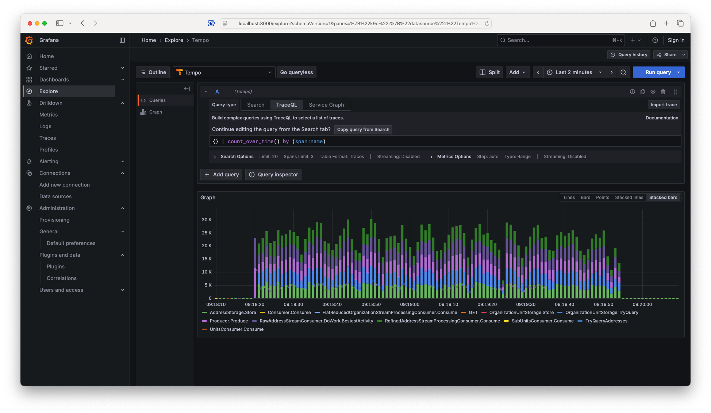
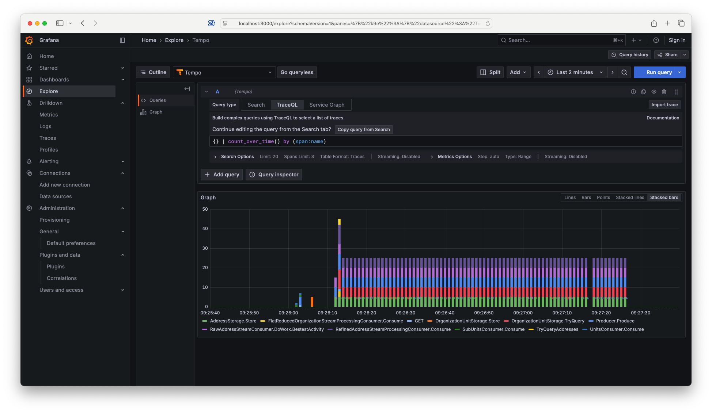

ToDo: Fluffify the text

# Scaling when working with observability locally

In this piece we'll look at how to deal with larger volumes of telemetry data locally, using the OpenTelemetry Collector to tackle the challenge.

# Background

Using [OpenTelemetry](https://opentelemetry.io/) has made making observable applications fairly easy to do. And because it's a widely adopted standard, there is excellent tooling surrounding it, enabling us to easily make sense and use of the telemetry data. What's really good is that we get a common and cohesive way to gain insights into how our applications interact and behave, even across environments. While there are excellent performance profiling and debugging tools, these are often hard or impossible to use in production. And if you are investigating performance related issues, enabling the tools can subtly change what you're trying to observe, messing with your work.

Thankfully [Grafana](https://grafana.com) has made a lightweight image that is simple to use, and makes getting started a breeze. Their OTel LGMT image ([image](https://hub.docker.com/r/grafana/otel-lgtm), [docs](https://github.com/grafana/docker-otel-lgtm/?tab=readme-ov-file#docker-otel-lgtm)) lets you spin up a whole observability stack in one go, that covers everything from the ingestion process, to the logs/metrics/traces storage and querying engines, and the Grafana web UI.

# Problem of the day

The problem has its roots in trying to match up two datasets of about 2 million entries. All in all, not a huge amount of data, 3 to 4 gigabytes each. However, occasionally having to reprocess it, makes the points in the process taking 1 to 10 milliseconds a painful bottleneck when you can observe most things taking tens to hundreds of microseconds. Initially the telemetry has already proved invaluable in speeding up some of the most egregious offense, especially the tracing.

The main part of our beings now with the pipeline growing longer, and [Tempo](https://grafana.com/oss/tempo/) basically [oom](https://en.wikipedia.org/wiki/Out_of_memory) killing the LGTM image observability stack. Which is highly annoying, because the traces are very useful at this stage. And it doesn't help that it takes Grafana down with it, along with the other creature comforts it provides.

At this point we could have ended the story early, by implementing [head sampling](https://opentelemetry.io/docs/concepts/sampling/#head-sampling) in the application(s). This is however not desirable, as the telemetry amounts are manageable for production, and it would be dumb to limit our insights into production because my laptop struggles to keep up.

# Tail Sampling

So what do we do? At the same place we learned about the existence of head sampling, we discover [tail sampling](https://opentelemetry.io/docs/concepts/sampling/#tail-sampling). Which should allow us to configure things locally so that while we generate the same amount of telemetry, thus not changing the codes behaviour and performance significantly, we don't necessarily process all of the gathered data. Perfect!

This however means that we must start tinkering with the [OpenTelemetry Collector](https://opentelemetry.io/docs/collector/) piece of the telemetry pipeline. And because the chill simplicity of the just spinning up the LGTM image goes bye-bye, we might as well set up things a bit more properly, with running separate images for the different components. This also has the added bonus of that if one of them dies, like say Tempo receives too many traces for the RAM allocated by Docker, the rest should still work!

So, in practice this means that we'll have to spin up 5 images, and create the configs for them:

- The OpenTelemetry Collector
- Loki (Grafanas log engine)
- Mimir (Grafans metrics engine)
- Tempo (Grafanas engine for traces)
- Grafana

There is a fully working example (at the time of writing at least) at the bottom of this article, as at this address: [TODO](./)

# First contact

Poking at the problem a bit, I stumbled upon the [Probabilistic Sampling Processor](https://github.com/open-telemetry/opentelemetry-collector-contrib/tree/main/processor/probabilisticsamplerprocessor). This looked really promising, because it can reduce the amount of data passed through, but retain interesting information like if any traces occur in bursts, how large they are. Sounds awesome! Looking into it a bit further, I discovered that to use it, I needed to stuff it into a policy as a member of a processing pipeline like the [Tail Sampling Processor](https://github.com/open-telemetry/opentelemetry-collector-contrib/tree/main/processor/tailsamplingprocessor) (the linked documentation has some more examples that what I'll cover here).

After some trial and error, I tried my luck with a configuration file for the open telemetry collector looking more or less like this:

```yaml
receivers:
  otlp:
    protocols:
      grpc:
        endpoint: opentelemetry-collector:4317
      http:
        endpoint: opentelemetry-collector:4318

processors:
  batch:
  memory_limiter:
    check_interval: 1s
    limit_mib: 1000
    spike_limit_mib: 100
  tail_sampling:
    decision_wait: 1s
    num_traces: 100_000
    expected_new_traces_per_sec: 10_000
    decision_cache:
      sampled_cache_size: 1_000_000
      non_sampled_cache_size: 1_000_000
    policies: [
        {
          name: percentage,
          type: probabilistic,
          probabilistic: {sampling_percentage: 0.001},
        },
      ]
exporters:
  otlphttp/loki:
    endpoint: http://grafana-loki:3100/otlp
  otlphttp/mimir:
    endpoint: http://grafana-mimir:9009/otlp
  otlp/tempo:
    endpoint: grafana-tempo:4317
    tls:
      insecure: true

extensions:
  health_check:

service:
  extensions: [health_check]
  pipelines:
    logs:
      receivers: [otlp]
      processors: [memory_limiter, batch]
      exporters: [otlphttp/loki]
    metrics:
      receivers: [otlp]
      processors: [memory_limiter, batch]
      exporters: [otlphttp/mimir]
    traces:
      receivers: [otlp]
      processors: [memory_limiter, tail_sampling, filter, batch]
      exporters: [otlp/tempo]
  telemetry:
    logs:
      level: debug
```

Of course, on the first attempt of using it, it failed spectacularly. As it turns out, the lightweight OTel Collector image recommended for uses like running locally, didn't have the `probabilistic` sampling processor installed. After some wtf-ing and searching, I discovered that the reasonable approach to my voes would be going over to use the [OpenTelemetry Collector Contrib](https://github.com/open-telemetry/opentelemetry-collector-contrib) [image](https://hub.docker.com/r/otel/opentelemetry-collector-contrib) instead, as it comes with more or less all the commonly used processors.

So then, armed with the new image I set out. And it worked!

But, I soon after observed that the most frequently occurring [trace spans](https://opentelemetry.io/docs/concepts/signals/traces/#spans) in the application had such a large volume, that they simply drowned out the chances of sampling the ones more rarely emitted. With regards to Tempo dying because of memory issues it was certainly an improvement, but lots of observability of only one trace through a small part of the code was still not quite what I was looking for.

# Back to the drawing board

What comes next then, is trying to figure out if it's viable to start weeding out the most spammed spans. To do that, I needed a way to know which ones they were though. After some exploring in the Grafana UI and StackOverflow expeditions, I ended up with the Tempo [TraceQL](https://grafana.com/docs/tempo/latest/traceql/) query `{} | count_over_time() by (span:name)` to show how rate of different trace spans over time.



Now that there is an overview, we can more easily see where it's relevant to start. And as an added bonus, we have a way to check if what we're doing is accomplishing anything. So, we just pick one of our top offenders, and try reducing it to something reasonable.

But how do we target a specific span by name, for our Tail Sampling policy rules?

It turns out that the [OpenTelemetry Transformation Language (OTTL)](https://github.com/open-telemetry/opentelemetry-collector-contrib/tree/main/pkg/ottl) can be used for this. And with some more digging in the Tail Sampling docs the conclusion is that we probably want to use an `and` policy to combine the name matching rules with a probabilistic sampling policy to reduce the volume.

Practically we get something which looks something like the below:

```yaml
    policies: [
      {
        name: probabilistic-by-span-name-1,
        type: and,
        and: {
          and_sub_policy:
            [
              {
                name: name-match,
                type: ottl_condition,
                ottl_condition: { error_mode: ignore, span: [ 'name == "Span.First"' ] }
              },
              {
                name: percentage,
                type: probabilistic,
                probabilistic: {sampling_percentage: 0.001},
              },
            ]
          }
      },
    ]
```

Unfortunately, if you do this, you'll quickly discover that while the filter works and the targeted span gets through at a desirably reduced rate, nothing else gets through. Because the filter passes on what it picks up and massages, and drops everything else. But no big deal, that simply means we'll now try to invert the name matching policy, and pass everything else sampled at a 100% rate, as show below:

```yaml
    policies: [
      {
        name: probabilistic-by-span-name-1,
        type: and,
        and: {
          and_sub_policy:
            [
              {
                name: name-match,
                type: ottl_condition,
                ottl_condition: { error_mode: ignore, span: [ 'name == "Span.First"' ] }
              },
              {
                name: percentage,
                type: probabilistic,
                probabilistic: {sampling_percentage: 0.001},
              },
            ]
          }
      },
      {
        name: everything-else-1,
        type: and,
        and: {
          and_sub_policy:
            [
              {
                name: name-match,
                type: ottl_condition,
                ottl_condition: { error_mode: ignore, span: [ 'name != "Span.First"' ] }
              },
              {
                name: percentage,
                type: probabilistic,
                probabilistic: {sampling_percentage: 100},
              },
            ]
          }
      },
    ]
```

And it seems to work!

Awesome, now on to the other spans then.

# Failing to do multiple things at once

All that remains is expanding on the pattern discovered, and happily observing how our traces fare without Tempo suffering sudden death and dropping all the data.

But, after a quick and dirty copy paste job, it turns out we hit a new wall. While the approach works fine for root spans, once you have nested spans bot the parents and children become sampled at a 100% rate. So most of everything is invisible because we can't enable a log scale for the y-axis in the search results, and the OOM reaper still untimely comes for Tempo.

After absorbing the defat, it's time for some more research. After glancing at the Tail Sampling Processor docs again, the rate `rate_limiting` policy starts to look relevant and tempting. Reaching this point, screw it, let's try it and see if it works just chucking it in like this:

```yaml
    policies: [
      {
          name: global-rate-limit,
          type: rate_limiting,
          rate_limiting: {spans_per_second: 20}
      },
    ]
```

It's immediately obvious that it works as promised! Only 20 spans come through per second, and the OOM reaper no longer haunts Tempo. But now uncertainty begins to creep in. What about the other spans that come at very low rate? Are they guaranteed to be sampled? Or do we risk never seeing them?

After some brooding and consulting the docs in hopes of assurances that the assumptions which would be most convenient are true, we instead stumble upon the `drop` policy, which can be used as shown:

```yaml
    policies: [
      {
          name: drop-policy-1,
          type: drop,
          drop: {
            drop_sub_policy:
            [
              {
                name: name-match,
                type: ottl_condition,
                ottl_condition: { error_mode: ignore, span: [ 'name != "Span.First"' ] }
              }
            ]
          }
      },
    ]
```

At this point we've mostly gained all the insights we could hope to get from the most spammed traces, so I guess we could safely just drop all of them and get on with working with what remains? Then again that is no good, because the next developer (me in 4 months) might not realize that the dropped spans even exist, due to them not being visible.

We need something else.

# A new hope

Now, in a proper state of despair, there is finally room for hope to be born. So we hopefully go back to the docs. Could there be something else we can try? The `composite` policy example which originally looked a bit off from what we were trying to achieve, starts to look interesting. After many attempts illustrated above, and searches for how to make tempo be more judicious in what data to keep when it gets swamped, the ways we could probably make the `composite_sub_policy` section work as we want it to, starts becoming apparent. And the `max_total_spans_per_second` property, combined with the `rate_allocation` section, which has `percent` keys per entry, looks like the perfect hammer for my nail.

So, after waking up the creative bran cell from its slumber and copy-pasting the ottl conditions to the right places we get something interesting to try out:

```yaml
    policies: [
      {
        name: composite-policy-1,
        type: composite,
        composite:
          {
            max_total_spans_per_second: 100,
            policy_order:
              [
                composite-name-match-1,
                composite-name-match-2,
                composite-pass-rest,
              ],
            composite_sub_policy:
              [
                {
                  name: composite-name-match-1,
                  type: ottl_condition,
                  ottl_condition: { error_mode: ignore, span: ['name == "Span.First"'] },
                },
                {
                  name: composite-name-match-2,
                  type: ottl_condition,
                  ottl_condition: { error_mode: ignore, span: [ 'name == "Span.Second"' ] },
                },
                { name: composite-pass-rest, type: always_sample },
              ],
            rate_allocation:
              [
                { policy: composite-name-match-1, percent: 5 },
                { policy: composite-name-match-2, percent: 5 },
              ],
          },
      },
    ]
```

Running this seems successful at first glance. The number of incoming spans get limited as expected. But where are the spans we've not explicitly rate limited? I mean, the code looks more or less like the one in the docs? The `always_sample` policy looks sus, so let's try exchanging it with a known quantity, like an ottl expression picking up all spans with names: `'name != ""'`. Certainly this should pick up everything.

Here we go again then!

But no, still no sign off the rest. Ok, perhaps the docs are incomplete then? Let's try to see what happens we add a rate limit for the policy passing all of the rest of the spans. Something like `{ policy: composite-pass-rest, percent: 90 },` should do the trick.

And it works!



# Limitations

Finally we're done!

However, while we have a working solution, there are some concerns that are putting a damper on the excitement. Remembering to manually recalculate and adjust the rate the remaining unfiltered spans are sampled at when we need to rate limit something more kind of sucks.

After some experimentation it turns out that that setting the pass rate to 100 percent works. Actually you can allocate 100% of all the policies, and it still seems to work about the same. It is however a bit unclear how it works and how it's supposed to work. Are we guaranteed that all is passed along, but we get a higher multiple of the spans per second limit? Or will it like the rate limiting filer policy opaquely decide to just drop some spans? The docs don't say, and by now we've invested too much time to start studying the source code in depth. Best to just deal with the rate allocation by hand for now, while we wait for a loudness equalization equivalent.

Another significant limitation it's important to remain aware of is that this solution loses the information you would have gotten from the probabilistic sampling approach. Most importantly you miss all the information about relative volume of the spans over time, so for instance it will be harder to spot if a slowness occurs when the workload spikes in amount.

Piecing it all together, we arrive at the fully working solution, shown below.

# Fully working example

```yaml
networks:
  apps_network:
    attachable: true
    name: apps_network
    ipam:
      driver: default
      config:
        - subnet: "172.80.80.0/24"
        - subnet: "2001:8080:8080::/64"
services:
  create-observability-stack-configs:
    image: debian:stable-slim
    user: 1000:1001
    container_name: create-observability-stack-configs
    depends_on:
      set-up-container-mount-area:
        required: true
        restart: false
        condition: service_completed_successfully
    volumes:
      - .:/ProjectDir
    environment:
      RECREATE_IF_EXISTS: "false"
    entrypoint:
      - '/bin/bash'
      - '-c'
      - |
        echo '================ Creating directory structure ============================='
        mkdir -p /ProjectDir/ContainerData
        if [ ! -f /ProjectDir/ContainerData/.gitignore ]; then
          echo 'Creating gitignore so that you dont accidentally check in container data'
          echo 'If you want some of the container data checked in, simply add an exception to the gitignore'
          printf '%s\n' '*' '#!.gitignore' > /ProjectDir/ContainerData/.gitignore
        fi
        mkdir -p /ProjectDir/ContainerData/ObservabilityStackConfig
        cd /ProjectDir/ContainerData/ObservabilityStackConfig
        mkdir -p /ProjectDir/ContainerData/ObservabilityStackConfig/grafana
        mkdir -p /ProjectDir/ContainerData/ObservabilityStackConfig/grafana/datasources
        mkdir -p /ProjectDir/ContainerData/ObservabilityStackConfig/grafana-loki
        mkdir -p /ProjectDir/ContainerData/ObservabilityStackConfig/grafana-mimir
        mkdir -p /ProjectDir/ContainerData/ObservabilityStackConfig/grafana-tempo
        mkdir -p /ProjectDir/ContainerData/ObservabilityStackConfig/opentelemetry-collector
        echo '================ Done Creating directory structure ========================'
        # In the section below, note that cat <<'EOF' makes the output literal without bash attempting transforms,
        # but still need to escape $ with $$, so outputted $$ has to be rewritten to $$$$ here.
        echo '================ Creating Grafana Ini Config ============================='
        cat <<'EOF' > /ProjectDir/ContainerData/ObservabilityStackConfig/grafana/grafana.ini
        [auth]:
        disable_login_form: false

        [auth.anonymous]:
        enabled: true
        org_role: Admin

        [log]:
        mode: console
        level: error

        [feature_toggles]:
        enable: traceqlEditor traceQLStreaming metricsSummary tempoApmTable traceToMetrics

        [analytics]:
        enabled: false
        reporting_enabled: false
        check_for_updates: false
        check_for_plugin_updates: false
        EOF
        echo '================ Done Creating Grafana Ini Config ================================='

        echo '================ Creating Grafana Data Sources Config ============================='
        cat <<'EOF' > /ProjectDir/ContainerData/ObservabilityStackConfig/grafana/datasources/datasources.yaml
        apiVersion: 1

        datasources:
          - name: Loki
            type: loki
            uid: Loki
            url: http://grafana-loki:3100
            editable: true
            jsonData:
              derivedFields:
                - datasourceUid: "Tempo"
                  matcherRegex: "trace_id"
                  matcherType: "label"
                  name: "trace_id"
                  url: "$$$${__value.raw}"
          - name: Mimir
            type: prometheus
            uid: Mimir
            url: http://grafana-mimir:9009/prometheus
            editable: true
            jsonData:
              httpMethod: POST
              exemplarTraceIdDestinations:
                - datasourceUid: Tempo
                  name: trace_id
              prometheusType: Mimir
              prometheusVersion: 2.9.1
          - name: Tempo
            type: tempo
            uid: Tempo
            url: http://grafana-tempo:3200
            editable: true
            jsonData:
              httpMethod: GET
              nodeGraph:
                enabled: true
              search:
                filters:
                  - id": service-name
                    operator: =
                    scope: resource
                    tag: service.name
                  - id: span-name
                    operator: =
                    scope: span
                    tag: name
              serviceMap:
                datasourceUid: Mimir
              tracesToLogsV2:
                customQuery: true
                datasourceUid: Loki
                filterByTraceID: false
                query: '{$$$${__tags}} | trace_id="$$$${__trace.traceId}"'
                spanEndTimeShift: 30s
                spanStartTimeShift: -30s
                tags:
                  - key: service.name
                    value: service_name
        EOF
        echo '================ Done Creating Grafana Data Sources Config ========================'

        echo '================ Creating Grafana Loki Config ====================================='
        cat <<'EOF' > /ProjectDir/ContainerData/ObservabilityStackConfig/grafana-loki/config.yaml
        auth_enabled: false

        server:
          http_listen_port: 3100
          grpc_listen_port: 9096
          log_level: error

        common:
          instance_addr: 127.0.0.1
          path_prefix: /tmp/loki
          storage:
            filesystem:
              chunks_directory: /tmp/loki/chunks
              rules_directory: /tmp/loki/rules
          replication_factor: 1
          ring:
            kvstore:
              store: inmemory

        query_range:
          results_cache:
            cache:
              embedded_cache:
                enabled: true
                max_size_mb: 100

        schema_config:
          configs:
            - from: 2020-10-24
              store: tsdb
              object_store: filesystem
              schema: v13
              index:
                prefix: index_
                period: 24h

        limits_config:
          allow_structured_metadata: true

        analytics:
          reporting_enabled: false
        EOF
        echo '================ Done Creating Grafana Loki Config ========================='

        echo '================ Creating Grafana Mimir Config ============================='
        cat <<'EOF' > /ProjectDir/ContainerData/ObservabilityStackConfig/grafana-mimir/config.yaml
        # Do not use this configuration in production.
        # It is for demonstration purposes only.
        multitenancy_enabled: false

        memberlist:
          bind_addr:
            - 127.0.0.1
          join_members:
            - grafana-mimir-gossip-ring:7946

        blocks_storage:
          backend: filesystem
          bucket_store:
            sync_dir: /tmp/mimir/tsdb-sync
          filesystem:
            dir: /tmp/mimir/data/tsdb
          tsdb:
            dir: /tmp/mimir/tsdb

        compactor:
          data_dir: /tmp/mimir/compactor
          sharding_ring:
            kvstore:
              store: memberlist

        distributor:
          ring:
            instance_addr: 127.0.0.1
            kvstore:
              store: memberlist

        ingester:
          ring:
            instance_addr: 127.0.0.1
            kvstore:
              store: memberlist
            replication_factor: 1

        ruler_storage:
          backend: filesystem
          filesystem:
            dir: /tmp/mimir/rules

        server:
          http_listen_port: 9009
          log_level: error

        store_gateway:
          sharding_ring:
            replication_factor: 1

        limits:
          max_global_exemplars_per_user: 10000

        usage_stats:
          enabled: false
        EOF
        echo '================ Done Creating Grafana Mimir Config ========================'

        echo '================ Creating Grafana Tempo Config ============================='
        cat <<'EOF' > /ProjectDir/ContainerData/ObservabilityStackConfig/grafana-tempo/config.yaml
        distributor:
          receivers:
            otlp:
              protocols:
                grpc:
                  endpoint: grafana-tempo:4317

        ingester:
          flush_check_period: 1s
          lifecycler:
            address: grafana-tempo
            min_ready_duration: 1s
            ring:
              kvstore:
                store: inmemory
              replication_factor: 1
          max_block_duration: 1s
          trace_idle_period: 1s

        metrics_generator:
          processor:
            local_blocks:
              filter_server_spans: false
            span_metrics:
              dimensions:
                - operation
                - service_name
                - status_code
          storage:
            path: /tmp/tempo/generator/wal
            remote_write:
              - url: http://grafana-mimir:9009/api/v1/push
                send_exemplars: true
          traces_storage:
            path: /tmp/tempo/generator/traces

        stream_over_http_enabled: true

        server:
          grpc_listen_port: 9096
          http_listen_port: 3200
          log_level: error

        querier:
          frontend_worker:
            frontend_address: grafana-tempo:9096

        storage:
          trace:
            backend: local
            local:
              path: /tmp/tempo/blocks
            wal:
              path: /tmp/tempo/wal

        overrides:
          metrics_generator_processors:
            - local-blocks
            - service-graphs
            - span-metrics

        usage_report:
          reporting_enabled: false

        EOF
        echo '================ Done Creating Grafana Tempo Config =================================='
        echo '================ Creating OpenTelemetry Collector Config ============================='
        # Nice guide for filtering: https://last9.io/blog/opentelemetry-configurations-filtering-sampling-enrichment/
        # Updated docs with correct syntax:
        # - Tail sampler: https://github.com/open-telemetry/opentelemetry-collector-contrib/blob/main/processor/tailsamplingprocessor/README.md
        # - Filter: https://github.com/open-telemetry/opentelemetry-collector-contrib/blob/main/processor/filterprocessor/README.md
        # Note you have to use the otel contrib variant of the collector image to get these running
        cat <<'EOF' > /ProjectDir/ContainerData/ObservabilityStackConfig/opentelemetry-collector/config.yaml
        receivers:
          otlp:
            protocols:
              grpc:
                endpoint: opentelemetry-collector:4317
              http:
                endpoint: opentelemetry-collector:4318

        processors:
          batch:
          memory_limiter:
            check_interval: 1s
            limit_mib: 1000
            spike_limit_mib: 100
          tail_sampling:
            decision_wait: 1s
            num_traces: 100_000
            expected_new_traces_per_sec: 10_000
            decision_cache:
              sampled_cache_size: 1_000_000
              non_sampled_cache_size: 1_000_000
            policies:
              [
                  {
                    # Always pass errors further on, don't drop them
                    name: status-code,
                    type: status_code,
                    status_code: { status_codes: [ERROR] },
                  },
                  {
                    name: composite-policy-1,
                    type: composite,
                    composite:
                    {
                      max_total_spans_per_second: 100,
                      policy_order:
                      [
                        composite-name-match-1,
                        composite-name-match-2,
                        composite-name-match-3,
                        composite-name-match-4,
                        composite-name-match-5,
                        composite-pass-rest
                      ],
                      composite_sub_policy:
                        [
                          { name: composite-name-match-1, type: ottl_condition, ottl_condition: { error_mode: ignore, span: [ 'name == "Span.First"' ], spanevent: [] } },
                          { name: composite-name-match-2, type: ottl_condition, ottl_condition: { error_mode: ignore, span: [ 'name == "Span.Second"' ], spanevent: [] } },
                          { name: composite-name-match-3, type: ottl_condition, ottl_condition: { error_mode: ignore, span: [ 'name == "Spand.Second.Subspan"' ], spanevent: [] } },
                          { name: composite-name-match-4, type: ottl_condition, ottl_condition: { error_mode: ignore, span: [ 'name == "Span.Third.Subspan"' ], spanevent: [] } },
                          { name: composite-name-match-5, type: ottl_condition, ottl_condition: { error_mode: ignore, span: [ 'name == "Span.Third"' ], spanevent: [] } },
                          { name: composite-pass-rest, type: always_sample }
                        ],
                      rate_allocation:
                        [
                          { policy: composite-name-match-1, percent: 5 },
                          { policy: composite-name-match-2, percent: 10 },
                          { policy: composite-name-match-3, percent: 10 },
                          { policy: composite-name-match-4, percent: 10 },
                          { policy: composite-name-match-5, percent: 10 },
                          { policy: composite-pass-rest, percent: 100 }
                        ]
                    }
                  }
              ]
          filter:
            # Don't bother with samling health check event data, these are for kubernetes/docker, low value on telemetry end
            error_mode: ignore
            traces:
              span:
                - IsMatch(resource.attributes["http.url"], ".*/health")
            logs:
              log_record:
                - 'IsMatch(body, "healthy")'
                - 'severity_number < SEVERITY_NUMBER_WARN'

        exporters:
          otlphttp/loki:
            endpoint: http://grafana-loki:3100/otlp
          otlphttp/mimir:
            endpoint: http://grafana-mimir:9009/otlp
          otlp/tempo:
            endpoint: grafana-tempo:4317
            tls:
              insecure: true

        extensions:
          health_check:

        service:
          extensions: [health_check]
          pipelines:
            logs:
              receivers: [otlp]
              processors: [memory_limiter, batch]
              exporters: [otlphttp/loki]
            metrics:
              receivers: [otlp]
              processors: [memory_limiter, batch]
              exporters: [otlphttp/mimir]
            traces:
              receivers: [otlp]
              processors: [memory_limiter, tail_sampling, filter, batch]
              exporters: [otlp/tempo]
          telemetry:
            logs:
              level: debug
        EOF
        echo '================ Done Creating OpenTelemetry Collector Config ========================'

  grafana:
    image: grafana/grafana:12.1.0
    depends_on:
      create-observability-stack-configs:
        required: true
        restart: false
        condition: service_completed_successfully
    ports:
      - 3000:3000
    networks:
      - apps_network
    volumes:
      - ./ContainerData/ObservabilityStackConfig/grafana/grafana.ini:/etc/grafana/grafana.ini
      - ./ContainerData/ObservabilityStackConfig/grafana/datasources:/etc/grafana/provisioning/datasources

  grafana-loki:
    image: grafana/loki:3.5
    depends_on:
      create-observability-stack-configs:
        required: true
        restart: false
        condition: service_completed_successfully
    command: ["-config.file=/etc/config.yaml"]
    networks:
      - apps_network
    volumes:
      - ./ContainerData/ObservabilityStackConfig/grafana-loki/config.yaml:/etc/config.yaml

  grafana-mimir:
    image: grafana/mimir:2.16.1
    depends_on:
      create-observability-stack-configs:
        required: true
        restart: false
        condition: service_completed_successfully
    command: ["-config.file=/etc/config.yaml"]
    networks:
      - apps_network
    volumes:
      - ./ContainerData/ObservabilityStackConfig/grafana-mimir/config.yaml:/etc/config.yaml

  grafana-tempo:
    image: grafana/tempo:2.7.2
    depends_on:
      create-observability-stack-configs:
        required: true
        restart: false
        condition: service_completed_successfully
    command: ["-config.file=/etc/config.yaml"]
    networks:
      - apps_network
    volumes:
      - ./ContainerData/ObservabilityStackConfig/grafana-tempo/config.yaml:/etc/config.yaml

  opentelemetry-collector:
    image: otel/opentelemetry-collector-contrib:0.130.1
    ports:
      - 4317:4317
      - 4318:4318
      - 9201:9201
    command: ["--config=/etc/config.yaml"]
    networks:
      - apps_network
    volumes:
      - ./ContainerData/ObservabilityStackConfig/opentelemetry-collector/config.yaml:/etc/config.yaml
    depends_on:
      - grafana-loki
      - grafana-mimir
      - grafana-tempo

  # otel-lgtm-stack:
  #   image: grafana/otel-lgtm
  #   ports:
  #     - 3000:3000
  #     - 4317:4317
  #     - 4318:4318
  #   networks:
  #     - apps_network
  #   environment:
  #     GF_PATHS_DATA: "/data/grafana"
  #   volumes:
  #     - "./ContainerData/OtelGrafana/tempo/data:/data/tempo"
  #     - "./ContainerData/OtelGrafana/grafana/data:/data/grafana"
  #     - "./ContainerData/OtelGrafana/loki/data:/data/loki"
  #     - "./ContainerData/OtelGrafana/loki/storage:/loki"
  #     - "./ContainerData/OtelGrafana/prometheus/data:/data/prometheus"
  #     - "./ContainerData/OtelGrafana/pyroscope/data:/data/pyroscope"
```

Share and enjoy!
