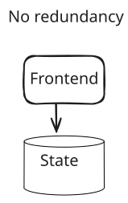
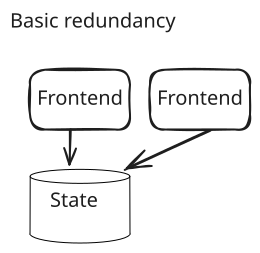
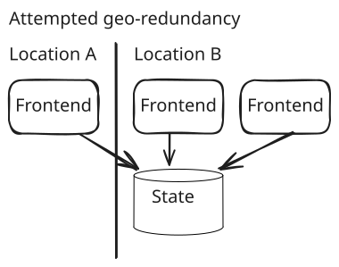
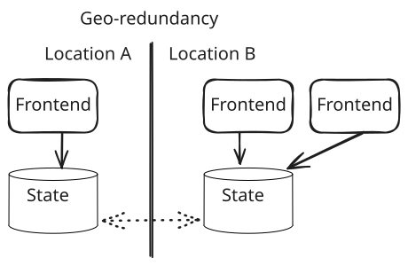
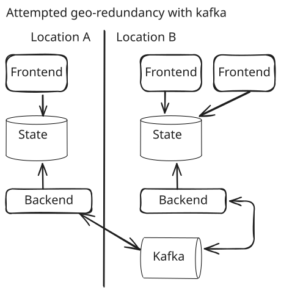
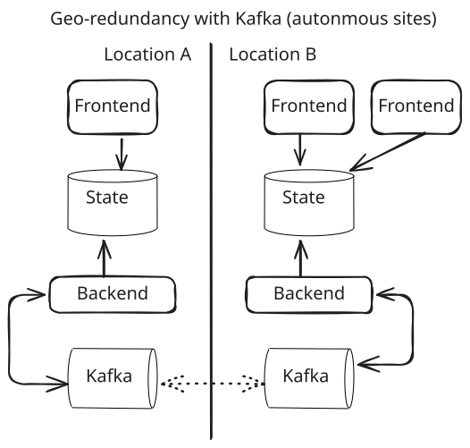
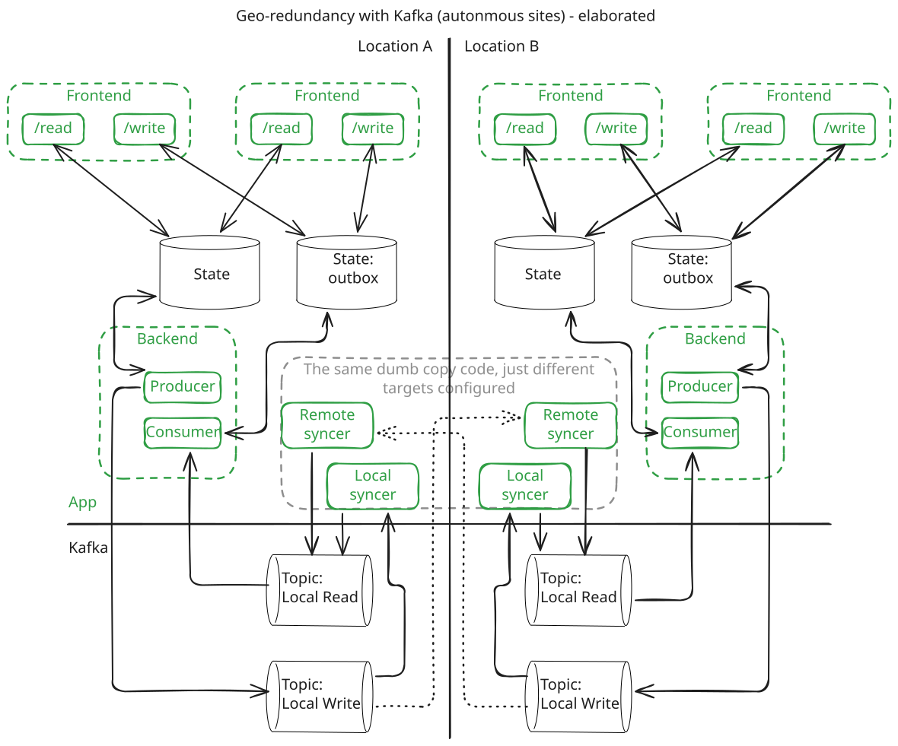
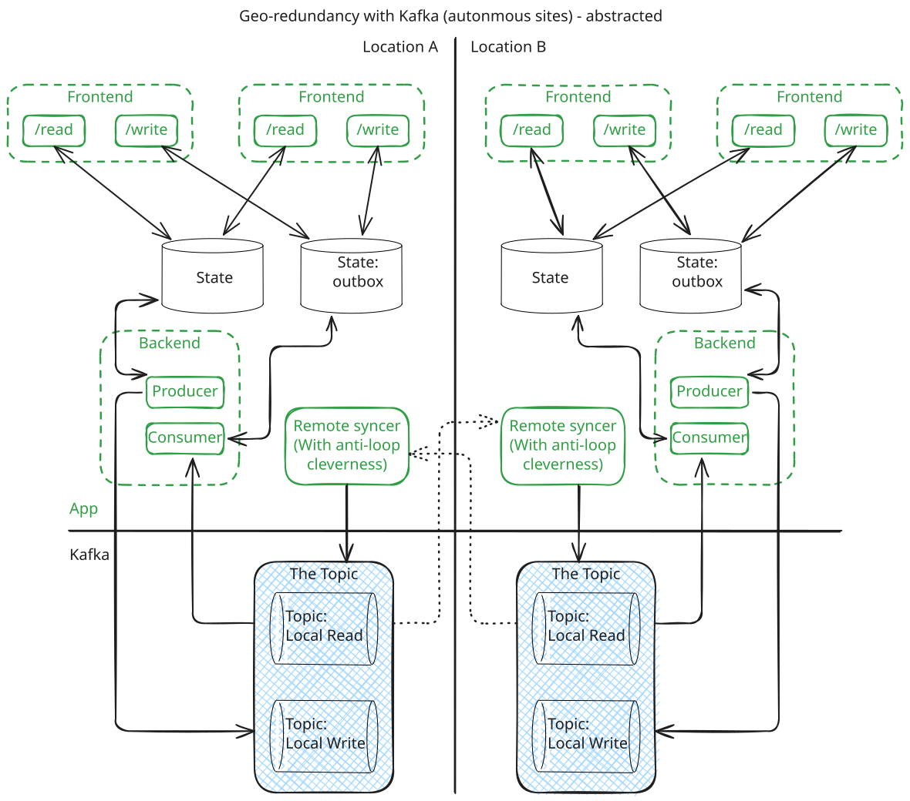

Redundant systems

I recently had to draw up some illustrations while discussing how we make redundant systems. I got feedback that they were highly useful for understanding, so I though I'd share them, and some light commentary.

Fist off we have our most basic case of redundancy: none.

Fairly basic, if anything fails it goes down. Not particularly resilient against any one component being overloaded either. But hey, it's the model that managed to stream video on demand to tens of millions of simultaneous users in the infancy of the [LAMP stack](https://en.wikipedia.org/wiki/LAMP_(software_bundle)). Should be sufficient for most things when serving a small place with a couple of million people like Norway.

Next, there are many reasons to take the next step on the ladder of redundancy, but it often ends up looking like this:

It's a neat model, allows for nice things rolling upgrades without downtime, without being very hard to implement. And as 1 can go down without downtime, we have proper redundancy!

Except, now we have an issue if our location goes down. The easy way to work around this is to take our now multi-instance capable frontend, and run another instance form another place like this:

We're not only redundant, we're geo-redundant! Pop the champagne! Well, not quite. If the location that harbors our state goes down, we're still completely down. Sure it might be expensive and big and hard to distribute, but seriously, people have been remedying this in production for longer than most of us have been alive.

Enter the solution of replicating the state storage across the locations as well:

After tossing in something like pgSync, we can finally call it a day, right? Well, it is nice. However, for across larger distances it starts to show strains, and we also have our events engine to think of.

But since we have Kafka, we can use it for sync and being even more redundant:

And it's glorious. Kafka itself can be set up to have as many redundant copies of the topics/data that we want, so we're golden now! While, yes, true, it is better, it still suffers from the same issue as when only spinning up another frontend at the other site in figure 3 above. Should the location with the Kafka cluster cease to exist due to an unfortunate infrastructure update, at least your event handling would still be completely gone, and your system as a whole would probably not be in a very good position in general.

But, as we saw with the situation above, we can remedy the situation by adding a box and a couple of arrows to the drawing and thereby materializing another Kafka cluster (almost as easy as giving your operations team another puppy for christmas!):

At this point questions arise. What is the dottet arrow between the two Kafka-thingies at each location? We know about throwing in software to sync database servers, but how could this be done? Wouldn't it be terribly complicated?

Certainly, it might look a bit complicated at the surface:

But it is quite simple actually. None of the components really have to do anything too complicated. Most of the components, like the state synchronization components are just copies of each other, and can be really simple internally.
It also scales awesomely to more than 2 locations. Sure, there is consistency across locations you now have to deal with being eventual, instead of instant when the single database moved the global clock and held the locks. But when you're present at more than 1 place you have to pay this price anyways.
But what about more magic, an easier life? Not so many topics? Wouldn't it be nice to do something like this:

Yes, can do this without really changing the main application code too much, or even at all. The built in Kafka mirror maker 2 also makes it not too difficult. However, here be dragons.

First off, the sync now has to do clever anti-looping shenanigans. Sure, you can use headers on Kafka messages to facilitate this, but it still compounds on your business flow.

Secondly, when all is flowing as it should, determining what the final order/merging at each location should be when reading becomes hard to control.

Third, if some site is away for a long time, or you need to re-organize how the difference between locations should be arranged into a new whole, it is way more work if this is your starting point.

To wrap it up I don't have a conclusion with nice snap and a dash of sass to whip up. However, I hope the illustrations and discussion gives something to think about, and stay mindful of why you're building redundancy. Because it's easy to be in many places to avoid ever being unavailable, only to become unavailable once a single location fails.
